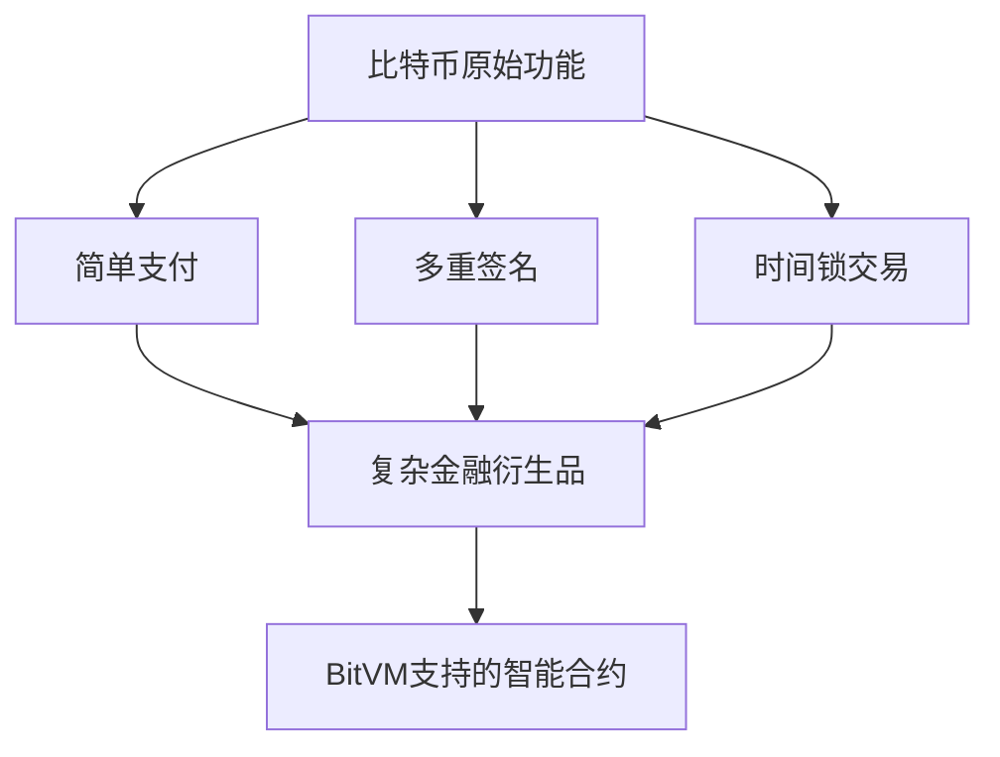

# BitVM：开启比特币智能合约新纪元

## 什么是BitVM？

BitVM（Bitcoin Virtual Machine）是一种突破性技术方案，它通过创新的验证机制让比特币网络首次具备了**图灵完备计算能力**。这项技术突破使得开发者能在不改变比特币底层协议的前提下，构建复杂的去中心化应用（dApps）。其核心价值在于：

- **无需硬分叉**：直接基于现有比特币协议实现功能扩展
- **无限计算潜力**：理论上可执行任何复杂度的智能合约
- **安全性保障**：继承比特币网络的抗审查特性

> "BitVM的出现，就像给比特币装上了可扩展的火箭推进器，既保持了核心系统的稳定性，又解锁了无限可能。"

👉 [探索加密货币创新前沿技术](https://bit.ly/okx_welcome)

## 技术突破性解析

### 传统比特币脚本的局限
比特币原始脚本语言仅支持有限的操作码，这种设计虽保障了安全性，但也导致其难以支持复杂应用。例如传统脚本的限制包括：

| 功能维度       | 传统比特币脚本 | BitVM突破性改进 |
|----------------|----------------|------------------|
| 计算能力       | 有限状态机     | 图灵完备         |
| 合约复杂度     | 简单支付验证   | 支持复杂逻辑运算 |
| 扩展性         | 链上计算限制   | 无限计算潜力     |

### 核心技术创新
BitVM采用"挑战-应答"机制实现链下计算验证：
1. **验证者承诺**：在比特币链上声明计算结果
2. **争议解决机制**：通过分步验证确保计算正确性
3. **经济激励**：设置保证金制度防止恶意行为

这种设计巧妙地将复杂计算移至链下处理，仅需在链上验证关键步骤，既保证安全性又提升可扩展性。

## 对区块链生态的变革影响

### 与Layer2方案的协同效应
BitVM与现有Rollups技术形成完美互补：
- **计算层分离**：将复杂运算移至链下执行
- **数据可用性**：利用比特币作为安全锚定层
- **跨链互通**：构建连接其他生态的可信桥梁

案例：某DeFi项目通过BitVM实现：
- 交易吞吐量提升300倍
- 单笔交易成本降低至0.01美元
- 保持比特币级别的安全性

👉 [体验高效区块链应用](https://bit.ly/okx_welcome)

### 智能合约革命
传统比特币智能合约受限于脚本功能，而BitVM带来的变革体现在：

## 发展前景与挑战

### 潜在应用场景
1. **金融基础设施**
   - 去中心化交易所
   - 跨链资产托管
   - 复杂金融衍生品

2. **数字身份认证**
   - 抗审查身份系统
   - 可验证凭证发行

3. **数据存储方案**
   - 分布式文件系统
   - 链上数据锚定

### 当前待解决的问题
| 挑战类型       | 现状分析                 | 解决路径                   |
|----------------|--------------------------|--------------------------|
| 验证效率       | 多轮交互导致延迟         | 优化零知识证明技术       |
| 开发者生态     | 工具链尚不完善           | 构建IDE与开发框架        |
| 经济模型       | 保证金机制需动态调整     | 引入自动化调节算法       |

## 常见问题解答

**Q1：BitVM如何保证计算正确性？**  
A：通过创新的争议解决协议，任何错误计算都可在链上被挑战并验证，确保系统整体正确性。

**Q2：普通用户如何受益？**  
A：享受更丰富的比特币应用（如DeFi、NFT等），同时保持资金安全性和抗审查特性。

**Q3：是否会影响比特币交易速度？**  
A：所有复杂计算在链下完成，仅需在链上验证关键步骤，实际提升整体网络效率。

**Q4：与以太坊Layer2有何不同？**  
A：BitVM直接继承比特币安全性，无需依赖中间共识层，且完全兼容现有比特币网络。

👉 [获取区块链技术最新进展](https://bit.ly/okx_welcome)

## 未来展望

随着BitVM技术的持续演进，预计2025年将出现以下变革：
- **开发者生态爆发**：工具链完善将降低开发门槛
- **跨链互通加强**：构建连接各公链的价值枢纽
- **企业级应用落地**：推动机构投资者参与比特币生态

这项技术正在重塑比特币的定位，从单纯的"数字黄金"演变为具备无限可能的智能合约平台。对于关注区块链技术发展的从业者和投资者而言，这既是机遇也是需要深入研究的领域。

> "BitVM的最终形态，或将重新定义我们对区块链可能性的认知边界。"