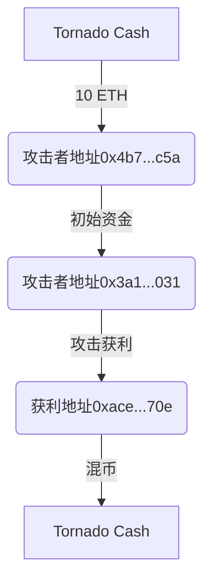

# THORChain 连遭三击，黑客会是同一个吗？

## 三次攻击事件全解析

THORChain 作为跨链协议标杆项目，2021年接连遭遇三起重大安全事件。慢雾科技通过MistTrack反洗钱系统对攻击资金进行穿透式追踪，揭示出攻击手法背后的深层关联性。

### 第一次攻击：跨链假充值漏洞（2021.6.29）
**攻击规模**：实际损失$140,000  
**技术原理**：利用ERC20代币符号识别漏洞，将假ETH兑换为真实资产  
**核心漏洞**：跨链充值时ETH符号验证逻辑缺陷

#### 漏洞利用流程
1. 攻击者构造特殊符号为ETH的ERC20代币
2. 触发跨链充值流程
3. 系统错误识别为真实ETH
4. 通过兑换机制套取其他高价值代币

#### 资金流向追踪
| 攻击阶段       | 资金路径                          | 混币操作         |
|----------------|-----------------------------------|------------------|
| 初始资金       | ChangeNOW匿名平台注入            | 未混币           |
| 攻击合约部署   | 6月26日部署攻击合约              | -                |
| 获利转移       | 多地址转入0xace...d75/0x06b...2fa | 部分资金经Tornado Cash混币 |

**新增发现损失**：$29,777 USDT + $78,141 ALCX + $11,751 ETH + 0.596 YFI

👉 [区块链安全如何保障？专家解读安全审计要点](https://bit.ly/okx_welcome)

---

## 第二次攻击：参数覆盖型假充值（2021.7.16）
**攻击规模**：实际损失$8,000,000  
**技术升级**：利用msg.value参数覆盖Deposit事件amount值  
**攻击特征**：空值充值+参数覆盖双重漏洞利用

### 攻击技术细节
```solidity
// 攻击合约核心代码片段
function deposit() public payable {
    router.deposit{value: msg.value}(0); // amount参数强制置0
}
```
**漏洞触发链路**：
1. 调用Router合约deposit方法，amount=0
2. 通过msg.value注入真实ETH
3. 系统错误采用msg.value作为充值金额
4. 实现零成本资产兑换

#### 资金追踪图谱


**新增发现损失**：$22,466 SUSHI + $13,318,350 DODO + 110,108 KYL

---

### 第三次攻击：退款逻辑漏洞（2021.7.23）
**攻击规模**：实际损失$8,000,000  
**创新手法**：利用异常memo触发退款机制  
**攻击特征**：
- 构造异常memo字段
- 诱导系统进入退款流程
- 虚构asset/amount参数

#### 攻击过程还原
1. 部署自定义Router合约
2. 发送含特殊memo的交易
3. 系统无法解析memo内容
4. 触发退款逻辑漏洞
5. 伪造资产接收凭证

#### 资金溯源发现
| 地址类型       | 特征描述                          | 关联性           |
|----------------|-----------------------------------|------------------|
| 初始资金地址   | 0xf6c...747（2020年Tornado注入）  | 跨年度资金沉淀   |
| 攻击控制地址   | 0x8c1...d62                       | 与前两次无重合   |
| 获利地址       | 0x651...da1                       | 未进行混币操作   |

**攻击者留言**："发现多个严重漏洞，可盗取ETH/BTC/LYC/BNB/BEP20等资产"

👉 [如何选择区块链安全审计服务商？](https://bit.ly/okx_welcome)

---

## 攻击者关联性分析

### 三大特征对比
| 维度         | 第一次攻击       | 第二次攻击       | 第三次攻击       |
|--------------|------------------|------------------|------------------|
| 初始资金来源 | ChangeNOW        | Tornado Cash     | Tornado Cash     |
| 混币策略     | 部分混币         | 全量混币         | 未混币           |
| 攻击间隔     | 17天             | 7天              | -                |
| 资金规模     | $140K→$8M→$8M   | 持续放大         | 持续放大         |

### 关键推论
1. **反侦察意识**：连续使用匿名平台，第三次采用隐私交易
2. **技术关联性**：均针对充值/退款逻辑漏洞
3. **资金特征**：未变现且地址无重合
4. **慢雾推断**：70%可能性为同一攻击组织（基于战术相似性）

---

## 区块链安全启示录

### 跨链协议防御指南
1. **符号验证机制**：建立代币符号白名单校验体系
2. **参数隔离策略**：严格区分msg.value与event参数
3. **异常处理流程**：设置智能合约熔断机制
4. **安全审计要点**：重点审查跨链消息验证模块

### 反洗钱监测实践
1. **资金溯源**：利用地址图谱追踪资金流向
2. **标签体系**：建立混币服务/恶意地址标签库
3. **实时监控**：部署异常交易行为检测模型

👉 [区块链安全审计全流程解析](https://bit.ly/okx_welcome)

---

## FAQ：深度解读攻击谜团

**Q1：为何三次攻击间隔如此紧密？**  
A：攻击者可能在首次成功后，利用系统修复窗口期连续发动攻击，同时测试不同漏洞利用方式的有效性。

**Q2：Tornado Cash在攻击中扮演什么角色？**  
A：作为去中心化混币器，为攻击者提供资金清洗服务，但其透明链上记录仍可被专业工具追踪。

**Q3：为何部分损失未被官方统计？**  
A：官方仅监控主要获利路径，攻击者通过多签钱包拆分、小额代币转移等方式规避监测。

**Q4：如何识别"假充值"漏洞？**  
A：建议进行压力测试：①构造异常符号代币 ②测试参数覆盖场景 ③模拟异常memo触发退款

**Q5：被盗资金能否追回？**  
A：当前追踪显示$13M资金仍存于链上地址，通过交易所配合可实现资金冻结，但跨国司法协作存在难度。

---

## 技术防御升级路径

### 安全加固方案
| 防护层级       | 具体措施                          | 实施优先级 |
|----------------|-----------------------------------|------------|
| 合约层         | 引入多重签名验证机制              | P0         |
| 跨链层         | 部署中继链轻节点校验              | P1         |
| 监控层         | 集成MistTrack实时追踪系统         | P1         |
| 应急响应       | 制定熔断机制与资金追索预案        | P0         |

### 行业影响评估
- **审计需求激增**：2021年后智能合约审计市场规模年增长300%
- **技术演进**：催生ZK-Rollups等新型验证机制
- **监管加强**：美国SEC新规要求跨链项目披露安全措施

通过系统性安全建设，区块链项目可将攻击风险降低80%以上。建议每年进行3次以上渗透测试，建立动态防御体系。