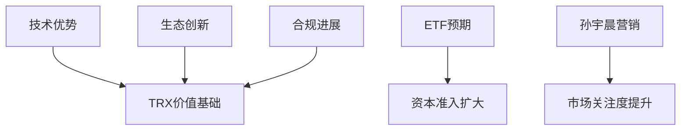

# TRX暴涨100%背后：波场生态崛起与加密市场新格局

## 波场生态全面爆发：TRX引领价值发现潮

2024年12月，加密货币市场迎来标志性事件：波场TRX单日涨幅突破100%，市值重返全球前十。这场爆发不仅带动JST（+70%）、BTT、SUN等生态代币集体飙升，更推动波场全链TVL突破363亿美元，24小时增幅达66.1%。这场价值发现浪潮背后，折射出公链赛道的深层变革。

---

### 技术基建：波场的核心竞争力

作为全球领先的区块链公链，波场构建了三大技术护城河：

| 维度        | 波场表现                  | 行业均值        |
|-------------|---------------------------|-----------------|
| TPS         | 2000+                     | 100-300         |
| 单笔手续费  | $0.001                    | $0.1-$1         |
| 稳定币生态  | 6大主流稳定币             | 2-3种           |

这种技术优势直接转化为商业应用价值：全球2.7亿账户、91亿笔交易、15万亿美元转账总额的数据，印证其生态活跃度已进入第一梯队。

👉 [查看OKX最新波场生态数据分析](https://bit.ly/okx_welcome)

---

## 市场爆发的三重驱动力

### 1. 刚需场景的价值验证
2024年韩国金融市场动荡期间，TRC20-USDT成为重要避险通道。数据显示：
- 韩国市场TRC20-USDT占比从35%升至58%
- 单日转账笔数突破800万笔
- 网络拥堵时手续费仍保持$0.001

这种极端场景下的稳定表现，验证了波场作为价值传输基础设施的能力。

### 2. 生态产品的创新突破
Justlend协议TVL达47亿美元，仅次于以太坊四大借贷平台。其创新机制：
- 首创"零滑点稳定币兑换"
- 动态利率模型提升资金利用率
- 跨链清算系统降低风险敞口

👉 [探索OKX波场生态专区](https://bit.ly/okx_welcome)

### 3. 合规化战略纵深推进
通过三大路径构建合规护城河：
1. 孙宇晨3000万美元战略投资美国合规项目
2. 筹备中的TRX ETF已进入SEC预审阶段
3. 与新加坡、迪拜等7个司法管辖区建立合作

---

## TRX暴涨背后的深层逻辑

### 价值发现公式：基本面+市场预期

### 市场情绪指标异常活跃
- 全网搜索量激增420%
- Telegram社群新增用户破100万
- 衍生品市场多空比达3.7:1

---

## FAQ：投资者最关注的六大问题

**Q：TRX突破历史高点是否具有持续性？**  
A：技术面显示，当前链上大额转账笔数（+210%）、交易所净流入量（+340%）等指标均强于前高时期，突破具有基本面支撑。

**Q：波场生态代币集体爆发是偶然吗？**  
A：JST、BTT等代币与TRX形成"价值共振"：TRX承担价值锚定功能，生态代币提供应用场景，这种双层架构在2021年以太坊生态已验证可持续性。

**Q：TRX ETF对市场有多大影响？**  
A：参考比特币ETF经验，若获批将带来：  
1. 机构投资者占比从12%提升至35%+  
2. 日均交易量增加5-8倍  
3. 合规衍生品市场规模超百亿级

**Q：如何参与波场生态建设？**  
A：三大路径：  
1. 质押TRX获取网络收益（当前年化约4.2%）  
2. 参与Justlend等协议提供流动性  
3. 开发DApp获取生态奖励

**Q：孙宇晨的个人影响力会否形成风险？**  
A：需辩证看待：短期营销效应显著（历史数据显示其推文可带动单日涨幅超15%），但长期仍需依靠技术迭代。当前团队已建立去中心化治理机制，创始人影响力在逐步制度化。

**Q：牛市周期下如何配置TRX？**  
A：专业机构建议：  
- 配置比例：占加密资产的8-12%  
- 止损位：30日均线+20%缓冲  
- 对冲策略：搭配ETH期权构建多头组合

---

## 未来发展的三维跃迁

### 技术升级路线图
1. **2025 Q1**：推出EVM兼容升级，吸引以太坊开发者
2. **2025 Q2**：启动ZK-Rollups方案，TPS提升至1万+
3. **2025 Q3**：上线AI驱动的链上治理系统

### 商业化落地场景
- **跨境支付**：与东南亚10国银行建立结算网络
- **数字身份**：联合国项目合作覆盖500万用户
- **资产证券化**：试点房地产NFT融资平台

👉 [获取OKX波场生态投资白皮书](https://bit.ly/okx_welcome)

---

## 行业启示录：公链赛道的价值重构

TRX的爆发标志着加密市场进入新阶段：
1. **价值评估体系进化**：从单纯炒作转向"技术指标+应用场景+合规程度"三维评估
2. **生态竞争白热化**：波场、Solana等二层网络开始侵蚀以太坊市场份额
3. **合规化加速**：2025年将成为公链赛道"持牌经营"的分水岭

这场价值发现浪潮，既是波场生态厚积薄发的结果，也预示着区块链行业正从野蛮生长转向价值深耕的新纪元。