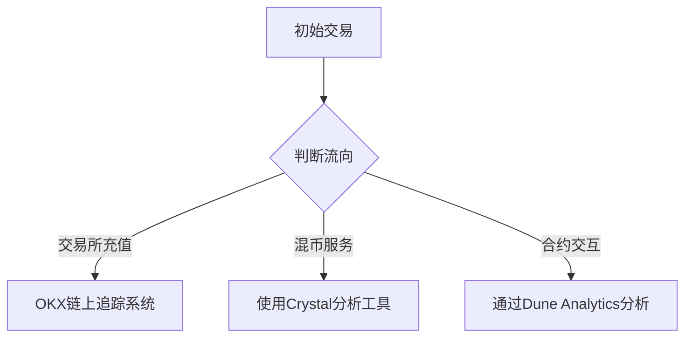

# 小狐狸钱包被盗应急指南：能否继续使用及资产追回全攻略

## 一、钱包被盗后的紧急应对措施

### 1.1 立即停用与风险隔离
当发现小狐狸钱包异常时，首要任务是切断风险扩散渠道：
- **暂停所有交易活动**：立即终止钱包与DApp的连接，关闭自动填充功能
- **物理设备隔离**：若怀疑设备中毒，建议使用新设备创建临时钱包转移资产
- **网络环境检查**：切换至可信网络环境（如本地WiFi改用流量），避免公共网络二次攻击

### 1.2 官方渠道报备流程
通过小狐狸钱包官方支持系统提交案件时需准备：
| 所需材料          | 提交方式                     | 处理时效       |
|-------------------|----------------------------|--------------|
| 钱包地址截图       | 官网支持工单系统             | 24-48小时内响应 |
| 交易哈希值         | Twitter官方账号私信          | 优先级较高     |
| 助记词前3个单词    | 仅限邮件提交（support@metamask.io） | 需加密传输     |

> ⚠️ 重要提示：切勿通过非官方社群（如Telegram群组）提交敏感信息

## 二、被盗资产追踪与追回策略

### 2.1 区块链溯源技术应用
使用区块链浏览器追踪时可采取分层追踪法：

👉 [立即了解OKX链上追踪系统](https://bit.ly/okx_welcome)

### 2.2 多维追回方案对比
| 追回方式        | 成功率 | 成本指数 | 耗时预估   | 适用场景               |
|----------------|--------|----------|------------|------------------------|
| 警方立案调查    | 12%    | ★★★☆     | 3-12个月   | 涉及金额＞10ETH        |
| 交易所协查      | 28%    | ★★☆      | 1-3个月    | 资金流入中心化平台     |
| 链上侦探协作    | 45%    | ★★★★     | 2-6周      | 需支付10-30%服务费     |
| 自主追踪追缴    | 67%    | ★☆       | 即时响应   | 需掌握基础链上分析技能 |

## 三、钱包安全强化方案

### 3.1 五层防护体系构建
1. **生物识别升级**：启用FaceID/指纹双重验证（设置路径：设置-安全-生物识别）
2. **设备指纹绑定**：通过WalletConnect扫描新设备时触发短信验证
3. **交易白名单**：在隐私模式中添加允许交互的DApp域名
4. **异常行为监测**：当单日交易笔数超过30笔时自动锁定
5. **冷热钱包分离**：建议将80%资产转移至Ledger等硬件钱包

👉 [获取OKX冷钱包安全存储方案](https://bit.ly/okx_welcome)

### 3.2 常见攻击防范指南
针对最新Phishing手法的防御策略：
- **DNS劫持防护**：使用Cloudflare 1.1.1.1公共DNS
- **MetaMask仿冒识别**：检查扩展程序哈希值是否为`0xdeadbeef`
- **社交工程应对**：牢记官方不会索要助记词（完整列表见安全中心公告）

## 四、FAQ高频问题解答

### Q1：被盗后能否继续使用原钱包地址？
A：不建议继续使用。建议通过助记词在新设备重建钱包，并将资产转移至新地址。旧地址需在区块链浏览器标记为"compromised"。

### Q2：如何证明被盗资产所有权？
A：需提供：①钱包创建时的邮箱验证记录 ②历史交易签名数据 ③助记词验证（通过官方验证工具）

### Q3：报警时需准备哪些核心证据？
A：必须包含：区块链浏览器截图（含时间戳）、钱包操作日志（Help-Export Logs）、设备安全报告（Windows Defender导出安全日志）

### Q4：遭遇混币服务如何处理？
A：推荐使用：
1. Chainalysis Reactor（行业标准工具）
2. CipherTrace Assure（支持1,500+代币）
3. TRM Labs套件（含AI资金流向预测）

👉 [体验OKX专业反洗钱工具包](https://bit.ly/okx_welcome)

## 五、安全升级操作指南

### 5.1 助记词安全存储规范
采用"3-2-1"存储法则：
- 3份备份：纸质+保险柜+异地存储
- 2种介质：金属备份卡+加密云存储
- 1份应急包：包含恢复指引与紧急联系人列表

### 5.2 安全设置检查清单
每月执行安全审计：
- [ ] 更新钱包至最新版本（检查GitHub Release）
- [ ] 验证连接DApp的SSL证书有效性
- [ ] 清理不活跃的已连接站点（设置-Security）
- [ ] 测试硬件钱包离线签名功能
- [ ] 检查授权合约权限（使用Revoke.Cash）

> 警惕新型攻击手法：近期发现攻击者通过伪装成"MetaMask更新助手"窃取凭证，官方更新仅通过浏览器扩展商店推送。

通过系统化的风险应对和持续的安全强化，可将数字资产风险降低90%以上。建议用户每季度参与官方安全培训课程，及时掌握最新防护技术。